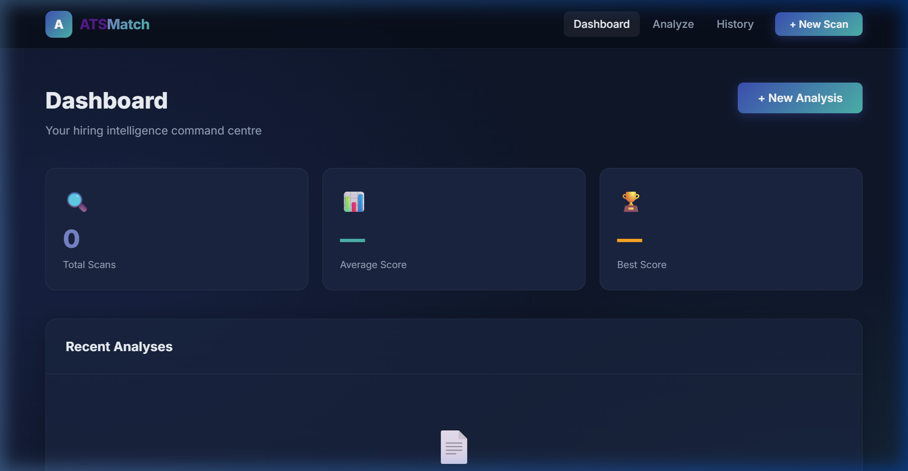
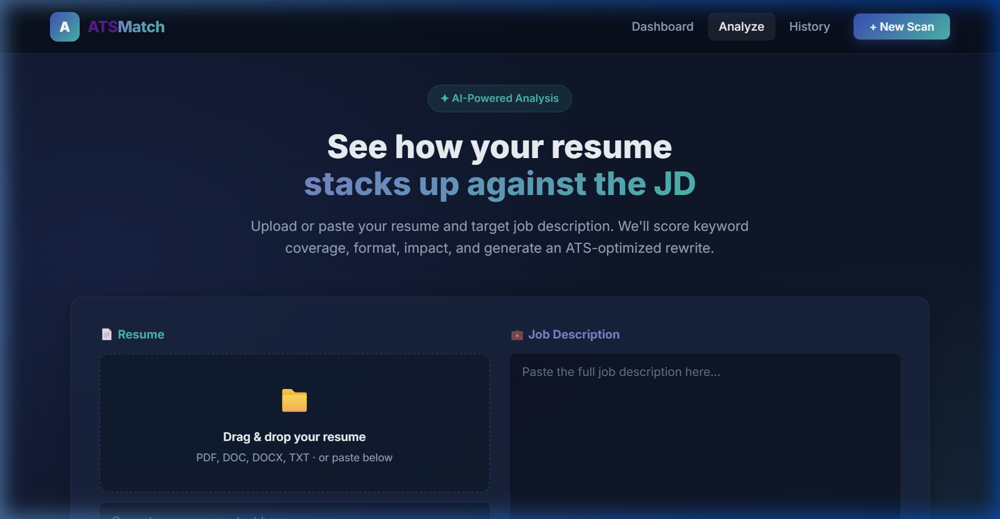
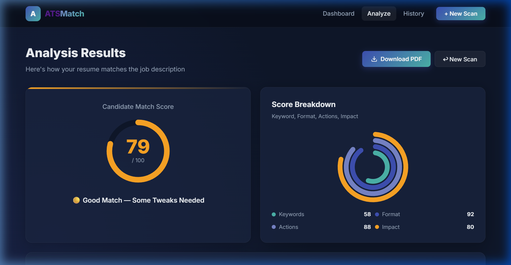
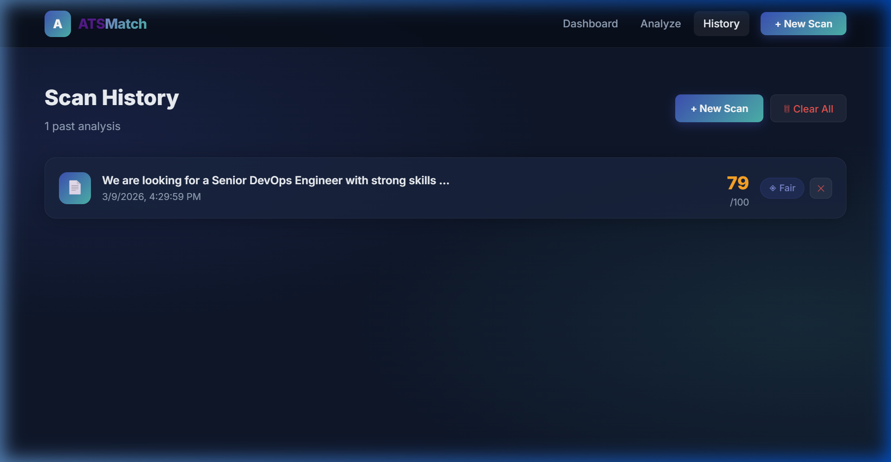

# ATSMatch — ATS Score Dashboard

A premium, AI-powered ATS (Applicant Tracking System) resume analysis dashboard built with **React**, **Vite**, and **Vanilla CSS**. Upload your resume, paste a job description, and instantly receive a detailed match score, keyword gap analysis, improvement tips, an intelligently rewritten resume, and a downloadable PDF report.

  

---

## ✨ Features

| Feature | Description |
|---|---|
| 🗂️ **Multi-page App** | Dashboard · Analyze · History — React Router navigation |
| 🖱️ **Drag-and-Drop Upload** | Drop PDF, DOCX, or TXT resume directly onto the upload zone |
| 📊 **ATS Score Dashboard** | Circular overall score + Recharts radial bar chart for sub-metrics |
| 🔍 **Keyword Analysis** | Matched vs. missing keywords extracted from the job description |
| 💡 **Improvement Tips** | Per-missing-keyword bullet point suggestions with example phrasing |
| ✨ **Resume Rewriter** | Intelligently rewrites your resume: power verbs, impact quantification, JD keyword injection |
| 📄 **PDF & TXT Download** | Export a formatted multi-section PDF report or plain TXT optimized resume |
| 📜 **Scan History** | Every analysis is persisted in localStorage with score, date, and JD snippet |

---

## 📸 Screenshots

### Dashboard — Hiring Intelligence Command Centre


### Analyze — Drag-and-Drop Resume Upload


### Results — ATS Score, Donut Charts & Keyword Analysis


### History — Past Scan Log



---

## 🛠️ Tech Stack

| Layer | Technology |
|---|---|
| Framework | React 18 + Vite 7 |
| Routing | React Router DOM v6 |
| Charts | Recharts (RadialBarChart) |
| File Upload | React Dropzone |
| PDF Export | jsPDF |
| Styling | Vanilla CSS (custom design system — Inter font, Deep Indigo + Soft Teal palette) |
| Storage | Browser localStorage (no backend required) |

---

## 🚀 Getting Started

### Prerequisites

- **Node.js** v18 or later — [Download Node.js](https://nodejs.org/)
- **Git** — [Download Git](https://git-scm.com/)

### 1. Clone the Repository

```bash
git clone https://github.com/sumanthlagadapati/ats-score-dashboard.git
cd ats-score-dashboard
```

### 2. Install Dependencies

```bash
npm install
```

### 3. Start the Development Server

```bash
npm run dev
```

Open your browser and navigate to **http://localhost:5173**

### 4. Build for Production

```bash
npm run build
```

The production-ready files will be in the `dist/` folder.

### 5. Preview the Production Build

```bash
npm run preview
```

---

## 📖 How to Use

1. **Dashboard** (`/`) — View your scan statistics, average score, and recent activity feed.
2. **Analyze** (`/analyze`) — Upload your resume (drag-drop or paste text) and paste the job description, then click **Analyze Resume**.
3. **Results** — Review your ATS match score with charts, keyword breakdown, improvement tips, and the rewritten resume preview.
4. **Download** — Click **Download PDF** for a formatted report, or **Download TXT** for the ATS-optimized resume text.
5. **History** (`/history`) — View all past analyses, individual scores, and delete entries as needed.

---

## 🗂️ Project Structure

```
ats-score-dashboard/
├── public/
├── src/
│   ├── components/
│   │   ├── Header.jsx          # Sticky nav with React Router links
│   │   ├── InputForm.jsx       # Drag-and-drop upload + paste form
│   │   ├── LoadingOverlay.jsx  # Animated processing screen
│   │   └── DashboardResults.jsx
│   ├── pages/
│   │   ├── Dashboard.jsx       # Home page with stats and activity
│   │   ├── ResultsPage.jsx     # Charts, keywords, tips, PDF export
│   │   └── HistoryPage.jsx     # localStorage history browser
│   ├── App.jsx                 # Router setup + resume analysis engine
│   ├── index.css               # Global design system (CSS variables, utils)
│   └── main.jsx
├── package.json
└── vite.config.js
```

---

## 🎨 Design System

| Token | Value | Usage |
|---|---|---|
| `--primary` | `#3F51B5` (Deep Indigo) | Headers, CTAs, primary actions |
| `--accent` | `#4DB6AC` (Soft Teal) | Highlights, matched keywords, success states |
| `--warning` | `#FFA726` | Moderate scores, tips |
| `--danger` | `#EF5350` | Low scores, missing keywords |
| Font | Inter (Google Fonts) | All text |

---

## 📦 Available Scripts

| Command | Description |
|---|---|
| `npm run dev` | Start dev server at http://localhost:5173 |
| `npm run build` | Build production bundle to `dist/` |
| `npm run preview` | Serve the production build locally |
| `npm run lint` | Run ESLint checks |

---

## 🔮 Roadmap

- [ ] Real AI backend integration (OpenAI / Gemini API) for smarter rewriting
- [ ] DOCX export for the rewritten resume
- [ ] User authentication and cloud history sync
- [ ] Multi-resume comparison mode
- [ ] Chrome extension for one-click JD capture

---

## 📄 License

MIT © [Sumanth Lagadapati](https://github.com/sumanthlagadapati)
